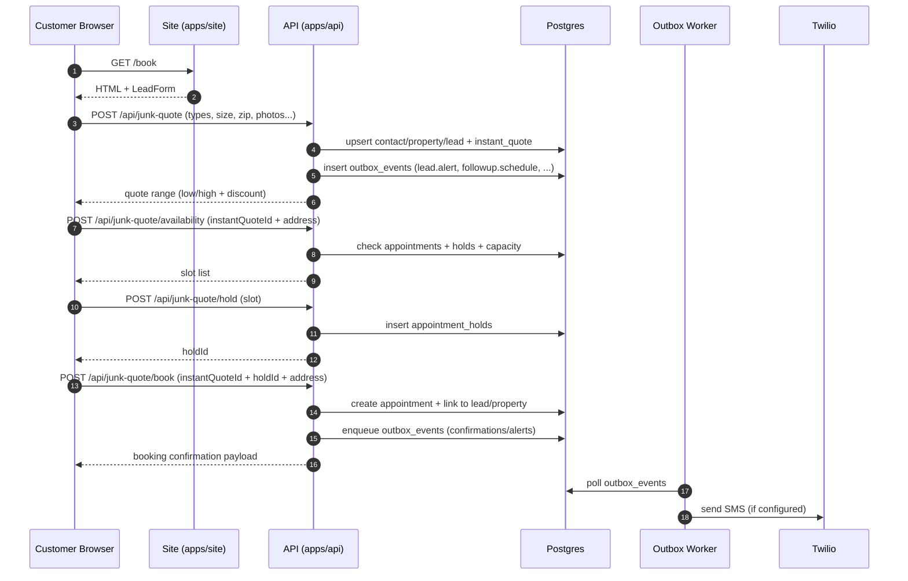
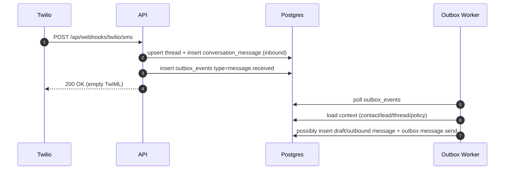
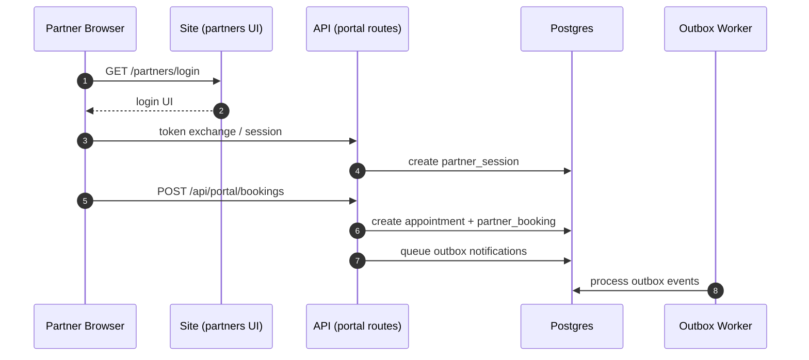

# Diagrams (Mermaid)

These diagrams are intended for quick “system shape” comprehension.

## Component map (production)

```mermaid
flowchart LR
  User[Customer / Partner / Staff] -->|HTTPS| Site[Site service (apps/site)]
  Site -->|HTTPS| Api[API service (apps/api)]
  Api --> DB[(Postgres)]
  Worker[Outbox Worker] --> Api
  Worker --> DB
  Discord[Discord Agent Worker] --> Api

  Twilio[Twilio] -->|webhooks| Api
  Meta[Meta/Facebook] -->|webhooks| Api
  SMTP[SMTP Provider] <-->|send| Worker
  GoogleAds[Google Ads API] <-->|sync| Worker
  GoogleCal[Google Calendar] <-->|sync| Api
```

## Public `/book` quote → book sequence



## Inbound SMS → inbox → automation



## Partner booking (portal)



